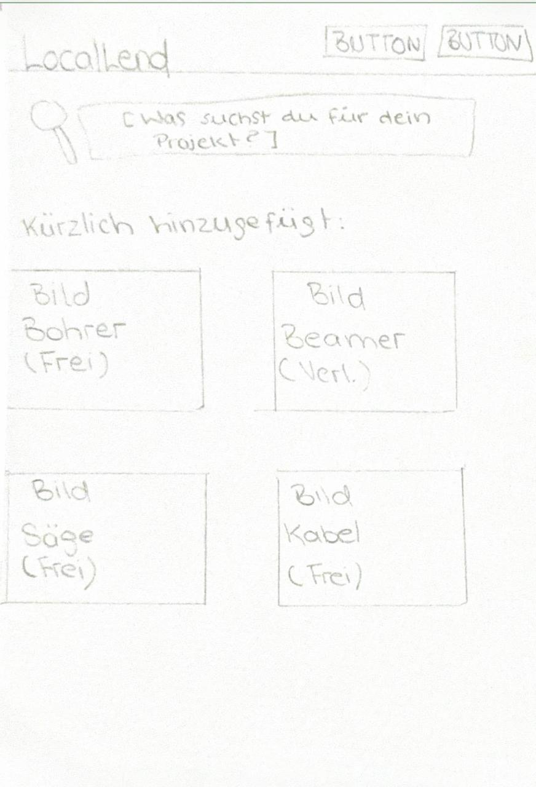
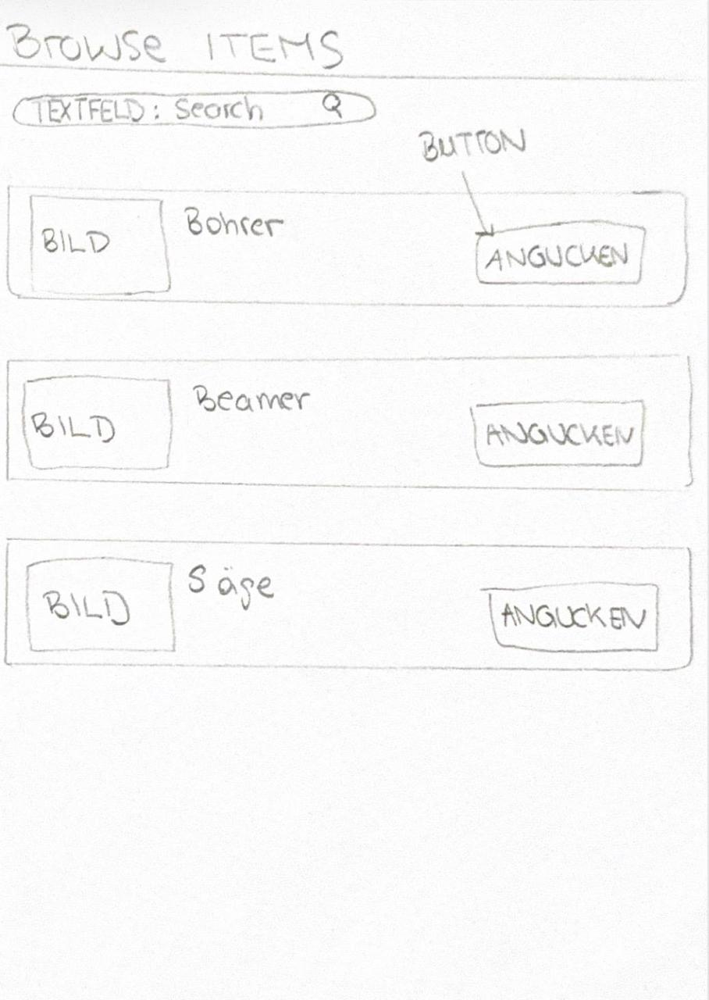
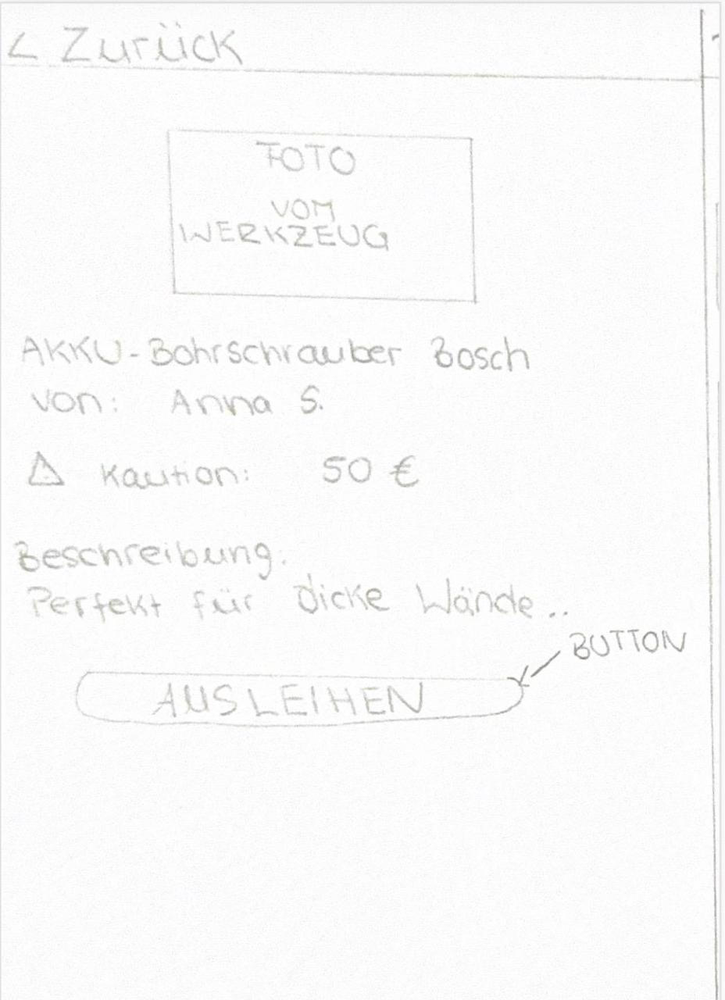
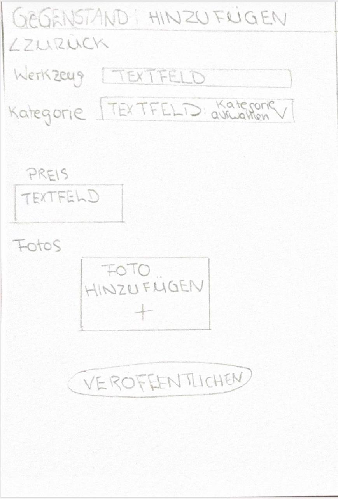
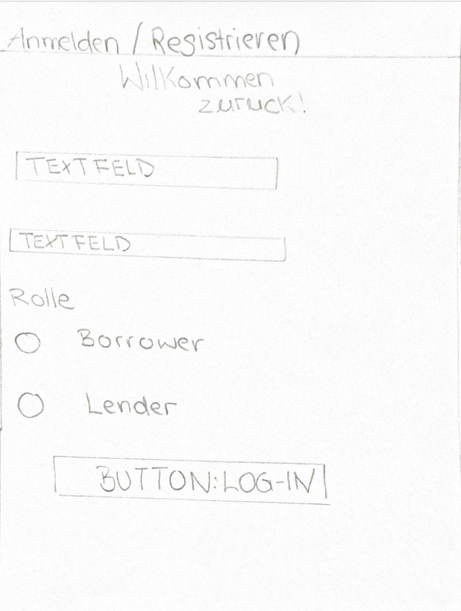
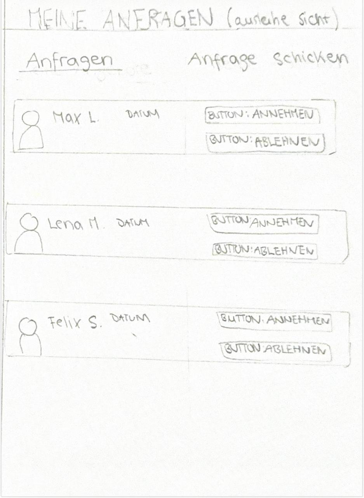

# LocalLend – Gruppe 5

## 1. Team Composition

**Team Name:** Gruppe 5 – LocalLend  

**Repository Access:**  
Unser GitHub-Repository ist auf "public" gestellt und die Dokumentation ist über GitHub Pages erreichbar.

---

## Contributors & Meta-Goals

| Contributor | Zielnote | Persönliches Ziel | Geplanter Beitrag |
|---|---|---|---|
| Tuba Celik | 1.0 | Verstehen, wie man mit Flask eine strukturierte Webanwendung entwickelt und Backend-Logik sauber implementiert | Entwicklung der Flask-Routen und Umsetzung der Anfragen-Logik |
| Jean Yves Nkwane | 1.0 | Verbesserung der Fähigkeiten in HTML, CSS und der Arbeit mit Jinja2 zur Gestaltung von Benutzeroberflächen | Gestaltung und Umsetzung der Benutzeroberfläche mit Jinja2-Templates |
| Wendy Sharonia Lontsi Doumtsop | 1.0 | Erlernen von relationalem Datenbankdesign und der Integration von SQLite in Webanwendungen | Modellierung der Datenbankstruktur für User, Items und Requests |
| Maryam Joumma | 1.0 | Verbesserung von Git-Workflows und strukturierter Projektorganisation in Teamprojekten | Verwaltung des Repositories, Dokumentation und GitHub Pages |

---

## 2. Value Proposition

LocalLend ist eine zweiseitige Plattform (Two-Sided Platform) für das lokale Verleihen und Ausleihen von selten genutzten Alltags- und Projektgegenständen innerhalb einer Hochschul-Community.

### Zielgruppe

Unsere primäre Zielgruppe sind Studierende und Personen im direkten Campus-Umfeld, die für kurzfristige Projekte, Umzüge, Präsentationen oder kleinere Reparaturen bestimmte Gegenstände benötigen, diese aber nicht selbst kaufen möchten.

Der Fokus liegt bewusst auf einer lokalen Hochschul-Community. Dadurch erhöhen wir die Wahrscheinlichkeit, dass Angebot und Nachfrage tatsächlich zusammenfinden, weil die Nutzer räumlich nah beieinander sind und ähnliche Alltagssituationen haben.

### Konkretisiertes Angebotsinventar

Um die Plattform realistisch und fokussiert zu halten, beschränken wir das mögliche Angebotsinventar zunächst auf Gegenstände, die häufig nur kurzfristig benötigt werden:

| Kategorie | Beispiele |
|---|---|
| Werkzeuge | Bohrmaschine, Akkuschrauber, Hammer, Schraubenzieher-Set, Wasserwaage |
| Umzug & Haushalt | Leiter, Sackkarre, Kabeltrommel, Werkzeugkoffer |
| Technik für Studium & Projekte | Beamer, Stativ, Adapter, HDMI-Kabel, Verlängerungskabel |
| Kreativ- & Projektbedarf | Schneidematte, Klebepistole, Laminiergerät, Kamera-Stativ |

Nicht im Fokus stehen sehr teure, gefährliche oder stark regulierte Gegenstände. Dadurch bleibt der Umfang der App überschaubar und die Nutzung für die Zielgruppe realistischer.

### Problem

Viele Studierende benötigen bestimmte Gegenstände nur für kurze Zeit, zum Beispiel für einen Umzug, eine Präsentation, ein Gruppenprojekt oder eine kleine Reparatur. Ein Neukauf lohnt sich für solche Einmal- oder Seltennutzungen oft nicht.

Gleichzeitig besitzen andere Studierende oder Personen im Campus-Umfeld genau solche Gegenstände, nutzen sie aber selten. Diese Gegenstände bleiben ungenutzt, obwohl sie für andere Personen kurzfristig hilfreich wären.

### Lösung

LocalLend ermöglicht es, solche Gegenstände lokal und unkompliziert zu verleihen und auszuleihen.

Nutzer können Gegenstände einstellen, verfügbare Gegenstände durchsuchen, Detailinformationen einsehen und eine Ausleihanfrage stellen. Der Verleiher kann die Anfrage anschließend annehmen oder ablehnen.

### Zwei Seiten der Plattform

| Seite | Beschreibung |
|---|---|
| Anbieter / Verleiher | Nutzer, die selten genutzte Gegenstände besitzen und anderen zur Verfügung stellen |
| Nachfrager / Leiher | Nutzer, die Gegenstände kurzfristig benötigen und diese ausleihen möchten |

Wichtig ist: Ein Nutzerkonto ist nicht dauerhaft auf nur eine Rolle beschränkt. Eine Person kann sowohl Gegenstände verleihen als auch selbst Gegenstände ausleihen. Die Begriffe „Verleiher“ und „Leiher“ beschreiben daher die Rolle innerhalb eines konkreten Nutzungsvorgangs.

### Nutzen für Verleiher

- Sinnvolle Nutzung selten verwendeter Gegenstände  
- Unterstützung anderer Personen in der lokalen Community  
- Möglichkeit, Gegenstände kontrolliert und nachvollziehbar zu verleihen  

### Nutzen für Leiher

- Kostenersparnis durch Ausleihen statt Kaufen  
- Schneller Zugriff auf Gegenstände in der Nähe  
- Weniger unnötige Anschaffungen für einmalige Nutzung  

---

## 3. Target Scope

Zur Darstellung des Funktionsumfangs unserer Web-App haben wir die wichtigsten Screens als UI-Scribbles entworfen.

Ziel ist es, die Struktur und den Ablauf der Anwendung zu visualisieren, nicht ein fertiges Design zu zeigen.

---

## UI Scribbles

### Scribble 1: Startseite

Die Startseite stellt LocalLend vor und zeigt eine Suchfunktion sowie verfügbare Gegenstände aus der lokalen Community. Nutzer erhalten hier einen schnellen Einstieg in die Plattform.

  

---

### Scribble 2: Gegenstände durchsuchen

Hier können Nutzer verfügbare Gegenstände durchsuchen. Jeder Eintrag enthält grundlegende Informationen sowie einen Button zur Detailansicht.

  

---

### Scribble 3: Detailansicht

Diese Seite zeigt detaillierte Informationen zu einem Gegenstand, zum Beispiel Beschreibung, Verfügbarkeit, Besitzer und Kaution. Von hier aus kann eine Ausleihanfrage gestellt werden.

  

---

### Scribble 4: Gegenstand erstellen

Nutzer können hier eigene Gegenstände einstellen, die sie verleihen möchten. Das Formular enthält Angaben wie Titel, Kategorie, Beschreibung, Kaution und ein Bild.

  

---

### Scribble 5: Login / Registrierung

Nutzer können sich registrieren oder anmelden. Ein Nutzerkonto kann sowohl zum Verleihen als auch zum Ausleihen verwendet werden. Dadurch muss sich eine Person nicht dauerhaft auf eine feste Rolle festlegen.

  

---

### Scribble 6: Anfragen verwalten

Hier sehen Nutzer eingehende Anfragen zu ihren eigenen Gegenständen und können diese annehmen oder ablehnen. Diese Ansicht bildet die zentrale Interaktion zwischen Angebot und Nachfrage ab.

  

---

## Happy Path

1. Ein Nutzer registriert sich und erstellt ein Konto.  
2. Derselbe Nutzer stellt einen Gegenstand ein, den er verleihen möchte.  
3. Ein anderer Nutzer durchsucht die verfügbaren Gegenstände.  
4. Der Nutzer öffnet die Detailansicht eines Gegenstands.  
5. Der Nutzer stellt eine Ausleihanfrage.  
6. Der Besitzer des Gegenstands sieht die Anfrage in seiner Anfragenübersicht.  
7. Der Besitzer akzeptiert die Anfrage.  
8. Der Status des Gegenstands ändert sich von „verfügbar“ zu „ausgeliehen“.  

Dieser Ablauf zeigt die zentrale Interaktion der Plattform: Ein vorhandenes Angebot trifft auf eine konkrete Nachfrage innerhalb einer lokalen Hochschul-Community.

---

## AI Directory

Wir dokumentieren unseren Einsatz von generativer KI transparent:

**Verwendete Tools:** ChatGPT / Gemini (Chat-Interface)  

**Art der Nutzung:**  
Unterstützung beim Brainstorming, Strukturierung der Value Proposition sowie beim Erstellen der Markdown-Dokumentation.

**Verantwortung:**  
Alle Inhalte wurden von uns überprüft und angepasst. Es wurden keine Agentic-AI-Tools verwendet, die eigenständig Code oder Repository-Strukturen erzeugen.
