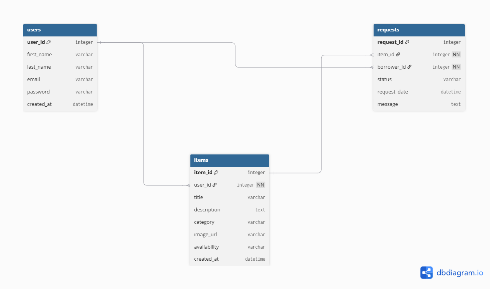

# Data Model - LocalLend

## Ziel des Datenmodells 

Das Datenmodell beschreibt, welche Daten die Anwendung speichern muss und wie diese Daten miteinander verbunden sind.

Für LocalLend werden drei zentrale Datenbereiche benötigt:

- Nutzer
- Gegenstände
- Ausleihanfragen

Diese drei Bereiche bilden die Grundlage für den Happy Path der Anwendung.

---

## Übersicht der Tabellen

Das Datenmodell besteht aus drei Haupttabellen:

| Tabelle | Zweck |
| --- | --- |
| users | Speichert registrierte Nutzer | 
| items | Speichert Gegenstände, die verliehen werden können |
| requests | Speichert Ausleihanfragen zwischen Nutzern und Gegenständen |

---

## Beziehungen zwischen den Tabellen

Ein Nutzer kann mehrere Gegenstände einstellen.

Ein Gegenstand gehört genau einem Nutzer.

Ein Nutzer kann mehrere Ausleihanfragen stellen.

Eine Ausleihanfrage bezieht sich genau auf einen Gegenstand.

```text
users
  1 ─── n items

users
  1 ─── n requests

items
  1 ─── n requests
```
  ## Tabelle: users

  Speichert alle registrierten Nutzer der Plattforrm.

  | Feld | Datentyp | Beschreibung |
|--------|--------|--------|
| user_id | INTEGER | Eindeutige Nutzer-ID (Primary Key) |
| first_name | TEXT | Vorname des Nutzers |
| last_name | TEXT | Nachname des Nutzers |
| email | TEXT | E-Mail-Adresse |
| password | TEXT | Passwort (verschlüsselt gespeichert) |
| created_at | DATETIME | Zeitpunkt der Registrierung |

#### Primärschlüssel

- user_id

### Begründung

Jeder Nutzer benötigt eine eindeutige ID, damit Gegenstände und Ausleihanfragen eindeutig zugeordnet werden können.

Die E-Mail-Adresse dient der Anmeldung und eindeutigen Identifikation des Nutzers.

## Tabelle: items

Speichert alle Gegenstände, die von Nutzern zum Verleihen angeboten werden.

| Feld | Datentyp | Beschreibung |
|--------|--------|--------|
| item_id | INTEGER | Eindeutige Gegenstand-ID (Primary Key) |
| user_id | INTEGER | Besitzer des Gegenstands (Foreign Key) |
| title | TEXT | Name des Gegenstands |
| description | TEXT | Beschreibung des Gegenstands |
| category | TEXT | Kategorie des Gegenstands |
| image_url | TEXT | Bild des Gegenstands |
| availability | TEXT | Verfügbarkeitsstatus |
| created_at | DATETIME | Zeitpunkt der Erstellung |

### Primärschlüssel

- item_id 

## Fremdschlüssel

- user_id -> users.user_id

## Begründung

Jeder Gegenstand gehört genau einem Nutzer.
Über die user_id kann nachvollzogen werden, welcher Nutzer den Gegenstand eingestellt hat.

Die Felder Titel, Beschreibung und Kategorie ermöglichen eine übersichtliche Darstellung und Suche innerhalb der Plattform.

Der Verfügbarkeitsstatus zeigt an, ob ein Gegenstand aktuell ausgeliehen werden kann.

## Tabelle: requests


Speichert alle Ausleihanfragen zwischen Nutzern und Gegenständen.

| Feld | Datentyp | Beschreibung |
|--------|--------|--------|
| request_id | INTEGER | Eindeutige Anfrage-ID (Primary Key) |
| item_id | INTEGER | Angefragter Gegenstand (Foreign Key) |
| borrower_id | INTEGER | Nutzer, der die Anfrage stellt (Foreign Key) |
| status | TEXT | Status der Anfrage |
| request_date | DATETIME | Zeitpunkt der Anfrage |
| message | TEXT | Optionale Nachricht des Nutzers |

### Primärschlüssel

- request_id

### Fremdschlüssel

- item_id → items.item_id
- borrower_id → users.user_id

### Begründung

Die Tabelle requests speichert alle Ausleihanfragen innerhalb der Plattform.

Über item_id wird festgelegt, welcher Gegenstand angefragt wird.

Über borrower_id wird gespeichert, welcher Nutzer die Anfrage gestellt hat.

Das Statusfeld ermöglicht die Verwaltung des Anfrageprozesses.

Mögliche Statuswerte:

- pending
- accepted
- rejected

## Zusammenfassung des Datenmodells

Das Datenmodell basiert auf drei zentralen Tabellen:

### users

Verwaltet alle registrierten Nutzer.

### items

Verwaltet alle Gegenstände, die zum Verleihen angeboten werden.

### requests

Verwaltet alle Ausleihanfragen zwischen Nutzern und Gegenständen.

### Datenbankstruktur

```text
users
│
├── items
│     └── requests
│
└── requests
```

Dieses Modell unterstützt den vollständigen Happy Path von LocalLend:

1. Nutzer registriert sich.
2. Nutzer erstellt einen Gegenstand.
3. Anderer Nutzer durchsucht verfügbare Gegenstände.
4. Nutzer stellt eine Ausleihanfrage.
5. Anfrage wird angenommen oder abgelehnt.


## ER- Diagramm

Das folgende Diagramm zeigt die Beziehungen zwischen den Tabellen `users`, `items` und `requests`.


