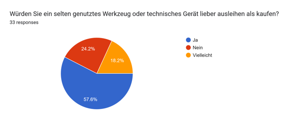
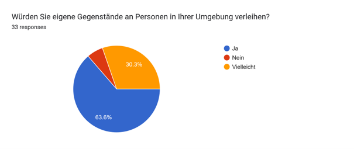
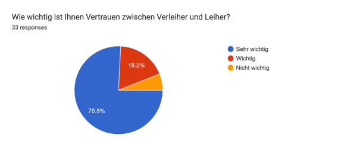
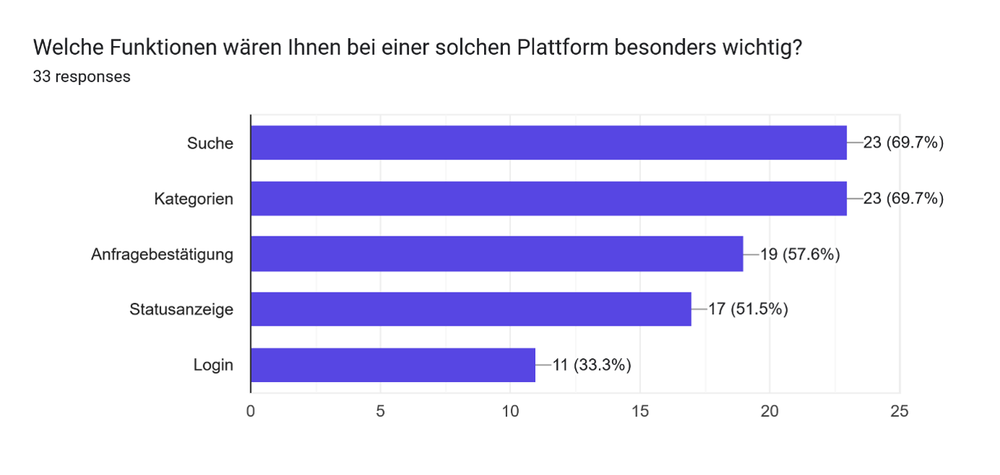
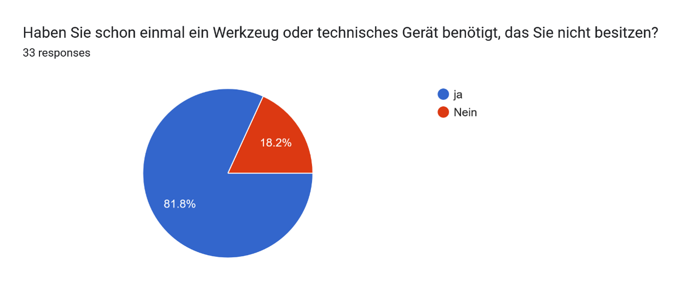
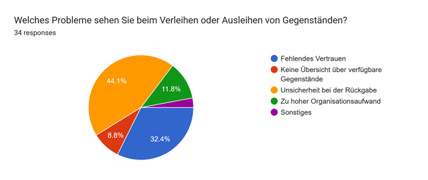

# User Survey – LocalLend

## Ziel der Umfrage

Im Rahmen der Product Discovery wurde eine Online-Umfrage durchgeführt, um den Bedarf für LocalLend zu überprüfen.

Ziel war es herauszufinden, ob Studierende und junge Erwachsene Werkzeuge oder technische Geräte benötigen, die sie nicht besitzen, ob sie solche Gegenstände lieber ausleihen als kaufen würden und welche Probleme beim Verleihen oder Ausleihen entstehen können.

Die Umfrage wurde anonym durchgeführt. Es wurden keine personenbezogenen Daten wie Namen, E-Mail-Adressen, Telefonnummern oder Adressen abgefragt.

---

## Aufbau der Umfrage

| Kategorie | Beschreibung |
|----------|--------------|
| Projekt | LocalLend |
| Methode | Online-Umfrage |
| Tool | Google Forms |
| Zielgruppe | Studierende und junge Erwachsene |
| Teilnehmerzahl | 25+ |
| Zeitraum | Juni 2026 |
| Fokus | Bedarf, Ausleihbereitschaft, Verleihbereitschaft, Vertrauen und gewünschte Funktionen |

---

## Umfragefragen

1. Haben Sie schon einmal ein Werkzeug oder technisches Gerät benötigt, das Sie nicht besitzen?
2. Würden Sie ein selten genutztes Werkzeug oder technisches Gerät lieber ausleihen als kaufen?
3. Würden Sie eigene Gegenstände an Personen in Ihrer Umgebung verleihen?
4. Wie wichtig ist Ihnen Vertrauen zwischen Verleiher und Leiher?
5. Welche Funktionen wären Ihnen bei einer solchen Plattform besonders wichtig?
6. Würden Sie lieber einen Gegenstand ausleihen als ihn für eine einmalige Nutzung zu kaufen?
7. Welche Probleme sehen Sie beim Verleihen oder Ausleihen von Gegenständen?

---

## Ergebnisse

| Frage | Ergebnis |
|------|----------|
| Werkzeug oder technisches Gerät benötigt, aber nicht besessen | Die Mehrheit der Befragten antwortete mit „Ja“. |
| Selten genutztes Werkzeug lieber ausleihen als kaufen | Die Mehrheit würde selten genutzte Gegenstände lieber ausleihen. |
| Eigene Gegenstände verleihen | Die Mehrheit kann sich vorstellen, eigene Gegenstände zu verleihen. |
| Vertrauen zwischen Verleiher und Leiher | Vertrauen wurde überwiegend als sehr wichtig bewertet. |
| Wichtige Funktionen | Suche, Kategorien, Anfragebestätigung, Statusanzeige und Login wurden häufig ausgewählt. |
| Einmalige Nutzung | Die Mehrheit würde einen Gegenstand lieber ausleihen als für eine einmalige Nutzung kaufen. |
| Probleme beim Verleihen oder Ausleihen | Unsicherheit bei der Rückgabe, fehlendes Vertrauen und organisatorischer Aufwand wurden am häufigsten genannt. |

---

## Detaillierte Auswertung

### Bedarf an Werkzeugen und technischen Geräten

Die Umfrage zeigt, dass viele Teilnehmer bereits ein Werkzeug oder technisches Gerät benötigt haben, das sie nicht selbst besitzen.

Dies bestätigt, dass ein reales Problem besteht: Nutzer benötigen gelegentlich Zugang zu Gegenständen, ohne diese dauerhaft besitzen zu müssen.

---

### Ausleihen statt Kaufen

Viele Teilnehmer gaben an, dass sie selten genutzte Werkzeuge oder technische Geräte lieber ausleihen als kaufen würden.

Das unterstützt die Grundidee von LocalLend, da die Plattform genau diesen kurzfristigen Zugang ermöglichen soll.

---

### Bereitschaft zum Verleihen

Die Mehrheit der Teilnehmer kann sich vorstellen, eigene Gegenstände an Personen in ihrer Umgebung zu verleihen.

Dadurch zeigt die Umfrage, dass nicht nur Nachfrage, sondern auch ein mögliches Angebot für eine lokale Verleihplattform vorhanden ist.

---

### Bedeutung von Vertrauen

Vertrauen wurde als einer der wichtigsten Faktoren bewertet.

Dies zeigt, dass ein Verleihprozess nicht vollständig automatisch ablaufen sollte. Nutzer möchten Kontrolle darüber behalten, wem sie ihre Gegenstände verleihen.

---

### Gewünschte Funktionen

Die wichtigsten gewünschten Funktionen waren:

- Suchfunktion
- Kategorien
- Anfragebestätigung
- Statusanzeige
- Login

Diese Ergebnisse zeigen, dass Nutzer eine einfache, übersichtliche und transparente Plattform erwarten.

---

### Probleme beim Verleihen und Ausleihen

Die häufigsten genannten Probleme waren:

- Unsicherheit bei der Rückgabe
- fehlendes Vertrauen
- organisatorischer Aufwand
- fehlende Übersicht über verfügbare Gegenstände

Diese Probleme wurden bei der Entwicklung von LocalLend berücksichtigt.

---

## Einfluss auf LocalLend

| Erkenntnis aus der Umfrage | Umsetzung in LocalLend |
|----------------------------|------------------------|
| Nutzer möchten Gegenstände schnell finden | Übersichtliche Gegenstandsliste und Suchfunktion |
| Nutzer möchten strukturierte Navigation | Kategorien |
| Verleiher möchten Kontrolle behalten | Anfrage-System |
| Vertrauen ist wichtig | Manuelle Bestätigung durch den Verleiher |
| Nutzer möchten Transparenz | Statusanzeige für Anfragen |
| Nutzer möchten nachvollziehbare Prozesse | Login und Benutzerverwaltung |

---

## Datenschutz

Die Umfrage wurde anonym durchgeführt.

Es wurden keine personenbezogenen Daten abgefragt. Die Antworten wurden ausschließlich für die Product Discovery und zur Validierung der Projektidee verwendet.

Dadurch wurde das Prinzip der Datensparsamkeit berücksichtigt.

---

## Fazit

Die Umfrage bestätigt die Relevanz von LocalLend.

Die Ergebnisse zeigen, dass viele Nutzer Werkzeuge oder technische Geräte nur gelegentlich benötigen und einen Kauf vermeiden möchten. Gleichzeitig besteht grundsätzlich Bereitschaft, eigene Gegenstände zu verleihen.

Die wichtigsten Anforderungen aus der Umfrage sind Vertrauen, Transparenz, einfache Suche und Kontrolle über Ausleihanfragen.

Diese Erkenntnisse haben die Entwicklung von LocalLend direkt beeinflusst.

---

# Diagramme der Umfrage

## Frage 1 – Bedarf an Werkzeugen und Geräten

## Frage 2 – Ausleihen statt Kaufen

## Frage 3 – Bereitschaft zum Verleihen

## Frage 4 – Bedeutung von Vertrauen

## Frage 5 – Probleme beim Verleihen und Ausleihen

## Frage 6 – Interesse an LocalLend

